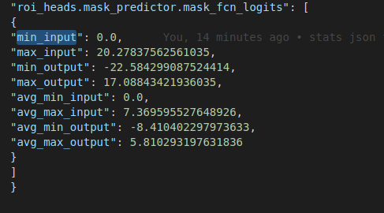

# Introduction
How to collect the statistics of object detection and classification models? ( with COCO and ImageNet dataset)
If you`d like to know some statistical information about model and dataset this repo is for you.
It gives you some info about minumun, maximum, and average of each model`s layer.

## output
At the end it should give a result like this:

